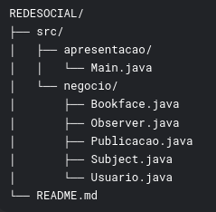
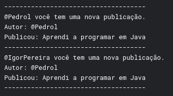

# 📋 Descrição do Projeto

Este projeto implementa uma simulação de rede social utilizando o __padrão Observer__ para notificar usuários sobre novas publicações em tempo real. O sistema permite que usuários façam publicações e sejam automaticamente notificados sobre as publicações de outros usuários.

***
# 🏗️ Estrutura do Projeto

***

# 🔍 Padrões de Projeto Implementados
### ✅ Padrão Observer
O projeto implementa consistentemente o padrão Observer com os seguintes componentes:

#### Interfaces:

* `Subject`: Interface que define os métodos para gerenciar observadores
* `Observer`: Interface que define o método `update()` para receber notificações

#### Classes Concretas:

* `Bookface` (Subject Concreto):
  * Mantém lista de observadores (`observers`)
  * Implementa `adicionar()` e `notificar()`
  * Notifica todos os observadores quando uma nova publicação é feita

* `Usuario` (Observer Concreto):
  * Implementa `update()` para reagir a notificações
  * Pode publicar conteúdo através do método `postar()`
 
***
# 🎯 Funcionalidades
* ✅ Cadastro de usuários
* ✅ Publicação de conteúdo textual
* ✅ Notificação em tempo real para todos os usuários
* ✅ Sistema de observadores para notificações push

***
# 🚀 Como Executar
#### Compilar o projeto
`javac -d bin src/negocio/*.java src/apresentacao/*.java`

#### Executar a aplicação
`java -cp bin apresentacao.Main`

***
# 📝 Exemplo de Saída

# 👥 Autor
Desenvolvido como projeto acadêmico para a disciplina de Padrões de Projeto

